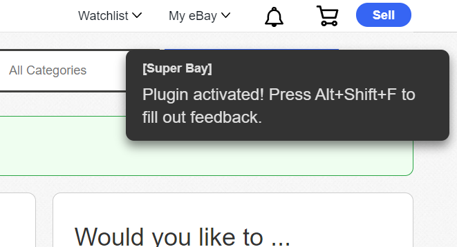
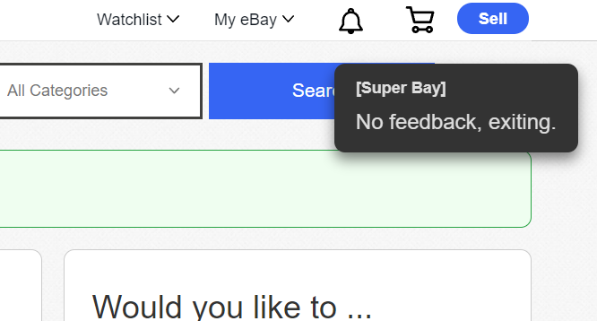

# Super Bay

Tampermonkey scripts to automate chores on ebay.

## Scripts/Features

Bracketed number corresponds to a script file under the [Install](#install) section.

### Automatic Feedback [1]

**Compatible page:** `ebay.com/fdbk/leave_feedback`

**How to use:** Press `Alt` + `Shift` + `F`

**Description:** Auto-fills **all visible feedback items** with five star ratings and generic positive messages. NOTE: Use the appropriate tab (Purchases or Sales) to filter down the list, or press the (x) on a feedback item to hide it temporarily while the script runs. You may need to refresh the page after running the script if you have many items to leave feedback on.

 

## Install

First add [tampermonkey to Chrome](https://chrome.google.com/webstore/detail/tampermonkey/dhdgffkkebhmkfjojejmpbldmpobfkfo).

Then [install Super Bay – Automatic Feedback](https://github.com/geotrev/super-bay/raw/main/auto-feedback.user.js).

### Get updates

You can optionally subscribe to updates in tampermonkey with the below steps.

1. Open the script in your tampermonkey dashboard.
2. Select the `Settings` tab on the left-hand tabset.
3. Under `Updates`, paste the url you copied contents from (again, see above).
4. Click the `Check for updates` checkbox.
5. Select `Save`
6. Go to `Settings` on the top right of the tampermonkey dashboard.

The above will check for updates weekly. If you want daily checks, go to `Settings` on thet op right of the tampermonkey dashboard, and under `Externals`, change `Update interval` to `Every Day`.

## Beta updates

If you want more frequent updates, replace `main` in the script file URL with `develop`. E.g., `/main/auto-feedback.js` becomes `/develop/auto-feedback.js`
